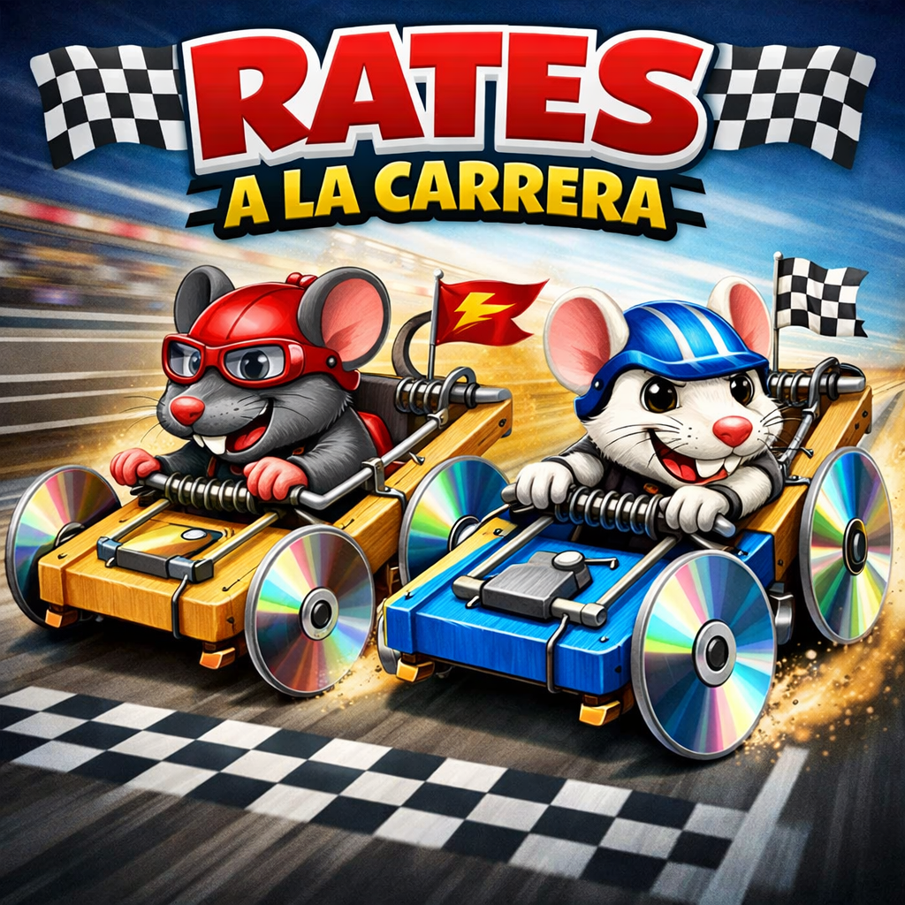
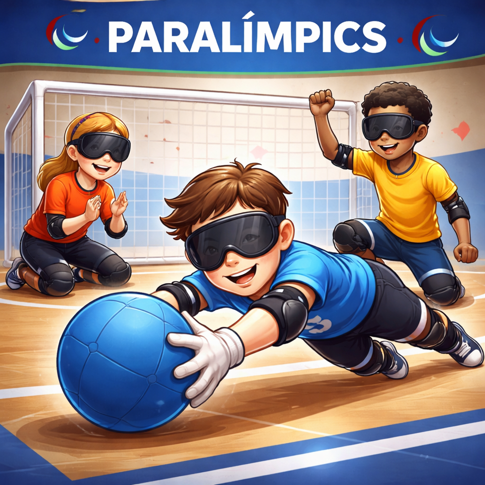
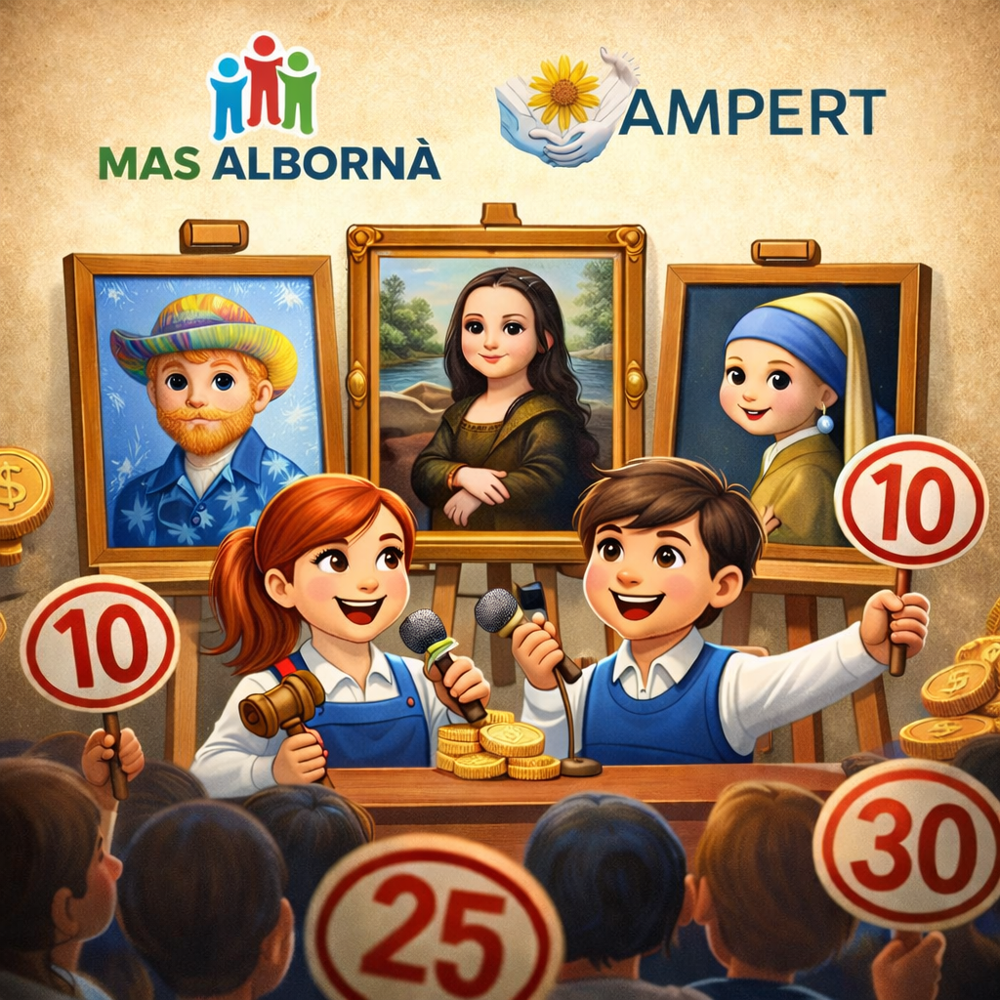
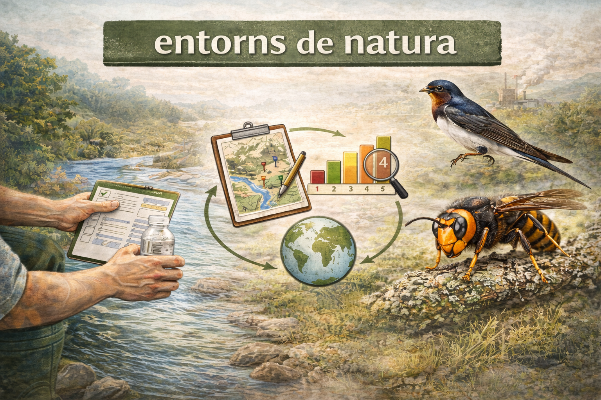
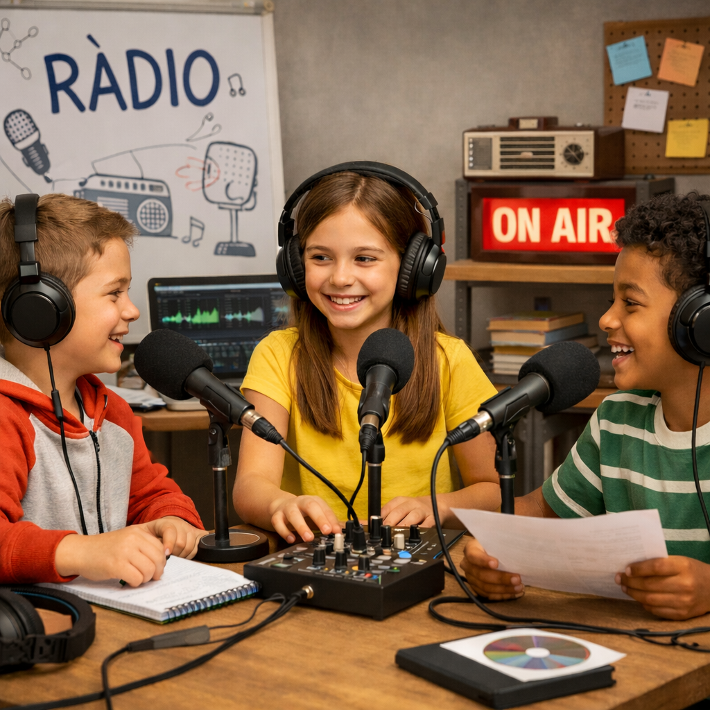
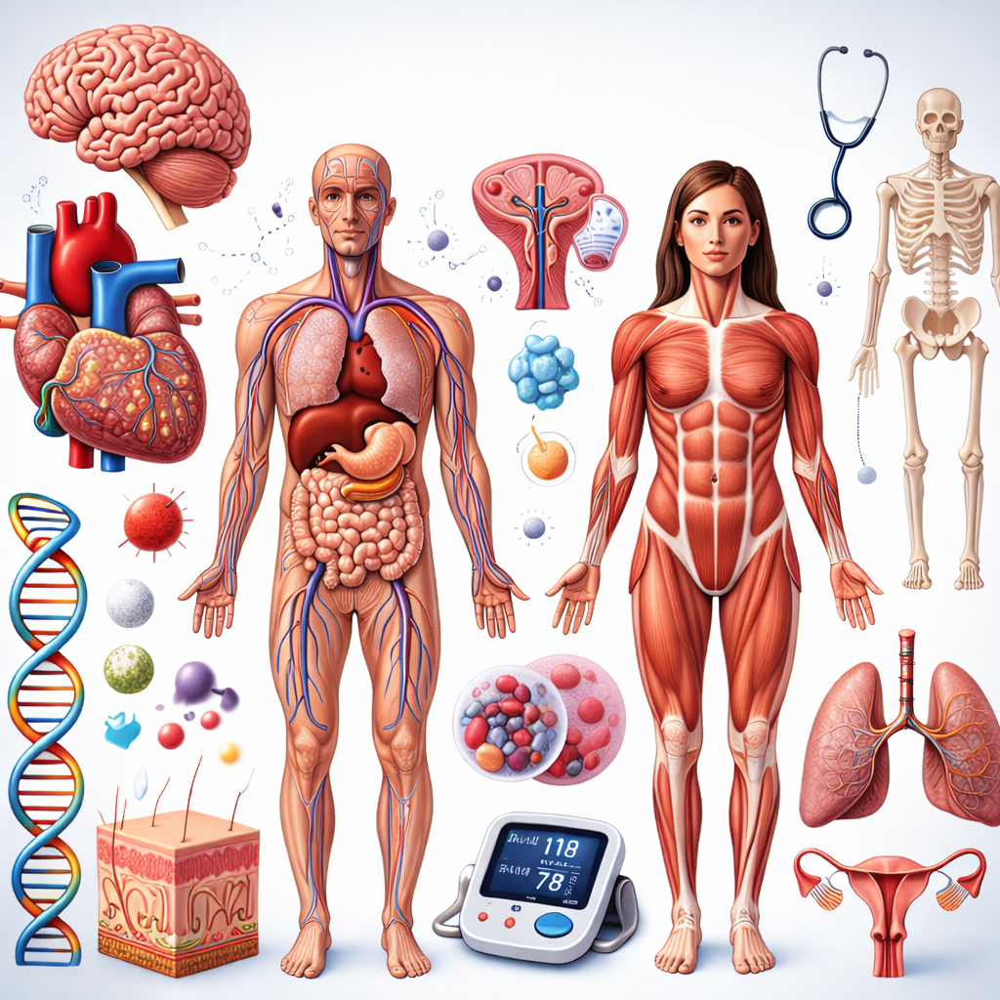
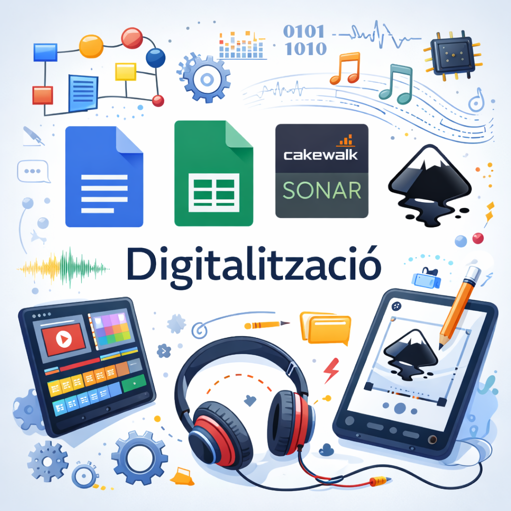
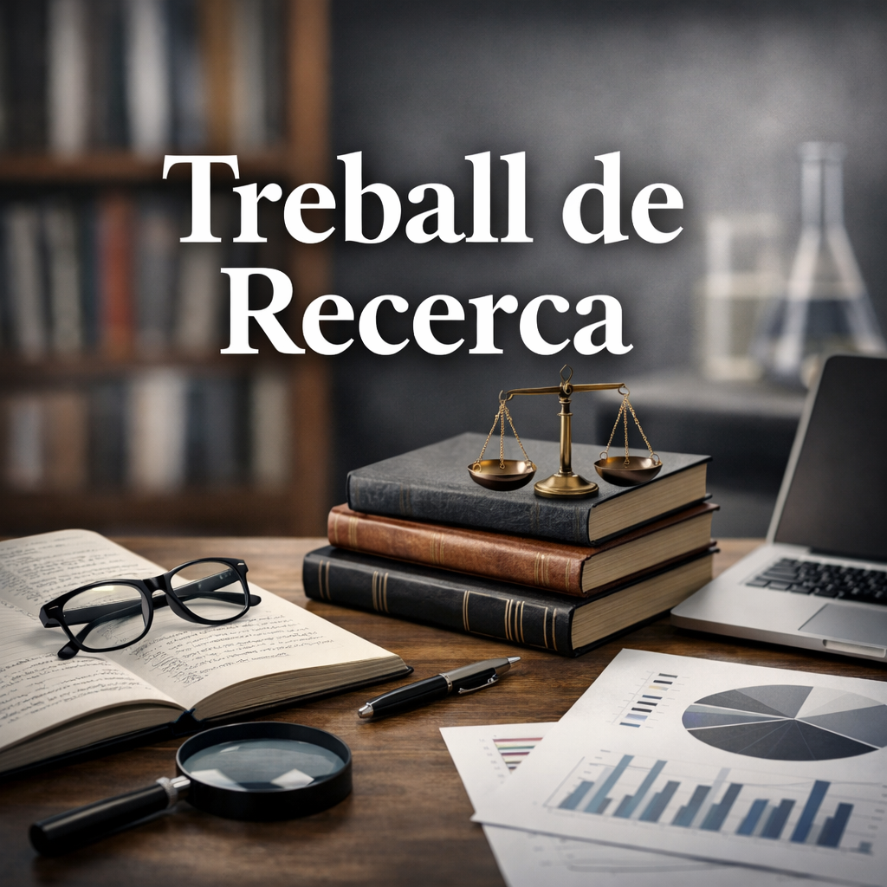

# Aula CreActiva

**Aula CreActiva** és un grup de professors de l'INS Institut Intermunicipal del Penedès (Sant Sadurní d'Anoia, Alt Penedès, Catalunya) que treballa per transformar l’educació i millorar els **aprenentatges competencials** de l’alumnat de l'ESO i Batxillerat.

Actualment, l'Aula CreActiva se centra en tres grans àmbits:

1. **Manteniment, millora i actualització de tots els projectes de l'Institut**
2. **Acompanyament del professorat en l’avaluació de les competències transversals a tota l’ESO**
3. **El desenvolupament d’una web app educativa** per ajudar l’alumnat a treballar continguts, activitats i reptes vinculats a diferents projectes i matèries.

---

## WEB APP

Aquesta web app és un entorn educatiu digital que recull activitats, jocs, recursos i materials per treballar diferents sabers i competències de manera més activa, aplicada i motivadora.

No és només un repositori de continguts, sinó una eina per:

- reforçar aprenentatges
- practicar competències
- estructurar activitats de projecte
- oferir materials interactius a l’alumnat
- connectar àrees, contextos i situacions d’aprenentatge

---

## Projectes principals de la web app

La web inclou activitats relacionades amb diversos projectes educatius de l’ESO, entre els quals destaquen:

### 1ESO - Projecte "Rates a la carrera"

Projecte amb activitats i recursos específics per treballar continguts i dinàmiques pròpies d’aquest entorn de treball.

### 1ESO - Projecte "Mediterrani"

Projecte amb activitats vinculades a continguts geogràfics, culturals i d’anàlisi del món mediterrani.

### 2ESO - Projecte "Paralímpics"

Projecte amb activitats relacionades amb l’esport, la inclusió, la tecnologia i altres aspectes educatius vinculats als Jocs Paralímpics.

### 3ESO - Projecte "Solidart"

Projecte orientat a activitats creatives, artístiques i de sensibilització, amb diferents recursos dins la web.

### 4ESO - Projecte "Entorns de Natura"

Projecte amb activitats relacionades amb el medi natural, la investigació, els rols de treball i l’anàlisi d’entorns.

---

## Altres àmbits i seccions de la web

A més dels projectes principals, la web app també incorpora activitats i recursos per a altres àrees i matèries, com ara:

### 2ESO - Optativa "Ràdio"

Activitats relacionades amb llenguatge radiofònic, connectors, àudio i producció de continguts.

### 2ESO - "Biologia"

Recursos i activitats per treballar continguts de biologia de manera visual i interactiva.

### 4ESO - Optativa "Digitalització"

Activitats orientades al desenvolupament de la competència digital i a l’ús d’eines tecnològiques.

### BAT - Treball de recerca de Batxillerat

Materials i activitats per ajudar l’alumnat a pensar preguntes investigables, enfocar temes, treballar bibliografia i estructurar millor el procés de recerca.

---

## Finalitat pedagògica

La web app s’emmarca dins la voluntat d’Aula CreActiva de promoure:

- aprenentatges competencials
- activitats contextualitzades
- treball interdisciplinari
- recursos digitals útils per a l’aula
- una educació més activa, connectada i significativa

---

## Instruccions

1. Els alumnes accedeixen amb el seu correu de l'escola i una contrasenya.
2. Se'ls activa els projectes en funció del curs que estan.
3. Dins de cada projecte, hi ha activitats creades per treballar diferents aspectes.
4. Les activitats serveixen per consolidar les aprenentatges i es poden fer diverses vegades.
5. Totes les puntuacions de les activitats es poden recuperar per utilitzar-les per la qualificació.
